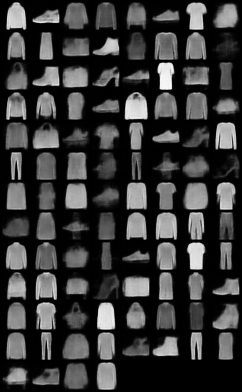

## VAE - Variational Autoencoder

This is an implemenation of VAE, which was introduced by Kingma et al. in ["Auto-Encoding Variational Bayes"](https://arxiv.org/pdf/1312.6114v10.pdf).

A Variational Autoencoder is a type of likelihood-based generative model. It consists of an encoder,
that takes in data  as input and transforms this into a latent representation, and a decoder,
that takes a latent representation and returns a reconstruction.
Inference is performed via variational inference to approximate the posterior of the model.

Some of the results can be seen in the samples folder. An example of fashion-mnist:

